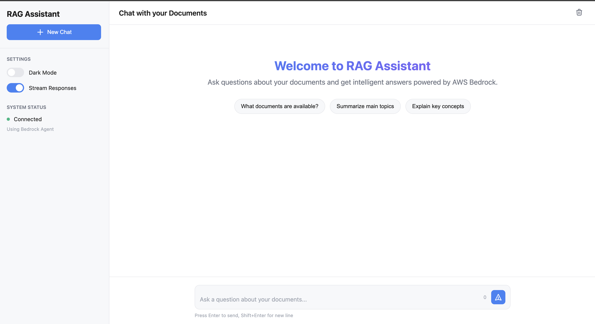

# 🤖 AWS Bedrock RAG Application

A modern **Retrieval-Augmented Generation (RAG)** application that leverages AWS Bedrock's AI capabilities with Knowledge Base and Agent services to provide intelligent document search and question-answering.

## ✨ Features

- **🔄 Real-time Streaming**: Word-by-word AI responses with loading indicators
- **📚 Intelligent Search**: Vector-based document retrieval using Bedrock Knowledge Base
- **🔗 Inline Citations**: Clickable reference links directly embedded in responses
- **🎯 Dual Backend Support**: Choose between Bedrock Agent or Knowledge Base
- **🌓 Modern UI**: Clean interface with dark/light mode toggle
- **📱 Mobile Responsive**: Works seamlessly across all devices
- **🐳 Docker Ready**: One-command deployment with Docker Compose

## 🏗️ Architecture


## 🚀 Quick Start

### Prerequisites
- **Docker & Docker Compose** (recommended)
- **Python 3.11+** (for local development)
- **AWS Account** with Bedrock access
- **uv** package manager (`curl -LsSf https://astral.sh/uv/install.sh | sh`)

### 1. Clone & Setup
```bash
git clone <your-repo-url>
cd bedrock-s3-vector-index-rag
cp .env.example .env
```

### 2. Configure Environment
Edit `.env` with your AWS credentials:
```bash
AWS_REGION=us-east-1
AWS_ACCESS_KEY_ID=your_access_key
AWS_SECRET_ACCESS_KEY=your_secret_key

# Choose your backend (true = Agent, false = Knowledge Base)
USE_AGENT=true

# For Bedrock Agent
BEDROCK_AGENT_ID=your_agent_id
BEDROCK_AGENT_ALIAS_ID=your_alias_id

# For Knowledge Base
BEDROCK_KNOWLEDGE_BASE_ID=your_kb_id
BEDROCK_MODEL_ID=anthropic.claude-3-sonnet-20240229-v1:0
```

### 3. Run the Application

#### Option A: Docker (Recommended)
```bash
make docker-up
```

#### Option B: Local Development
```bash
# Install dependencies
make install

# Terminal 1 - Start backend
make dev-server

# Terminal 2 - Start frontend
make dev-client
```

### 4. Access the Application
- **Frontend**: http://localhost:3000
- **Backend API**: http://localhost:8000
- **API Documentation**: http://localhost:8000/docs

## 📁 Project Structure

```
bedrock-s3-vector-index-rag/
├── 📁 client/                 # Frontend application
│   ├── index.html            # Main HTML interface
│   ├── app.js                # JavaScript logic & streaming
│   └── styles.css            # UI styling
├── 📁 server/                 # Backend API
│   ├── main.py               # FastAPI application
│   ├── bedrock_client.py     # Knowledge Base client
│   └── bedrock_agent_client.py # Agent client
├── 📁 infra/terraform/        # Infrastructure as Code
│   ├── main.tf               # Terraform configuration
│   ├── variables.tf          # Variables
│   └── lambda_sync.py        # S3 sync Lambda
├── 📁 tests/                  # Test suites
│   ├── unit/                 # Unit tests
│   └── integration/          # Integration tests
├── 🐳 docker-compose.yml      # Multi-container setup
├── 📋 Makefile               # Development commands
├── 🔧 pyproject.toml         # Python dependencies
└── 📄 .env                   # Environment variables
```

## 🛠️ Development

### Available Commands
```bash
make help              # Show all available commands
make install           # Install dependencies
make test              # Run all tests
make test-unit         # Run unit tests only
make test-integration  # Run integration tests only
make coverage          # Run tests with coverage report
make docker-build      # Build Docker containers
make docker-up         # Start with Docker Compose
make docker-down       # Stop Docker containers
make dev-server        # Start backend server
make dev-client        # Start frontend server
make clean             # Clean up generated files
```

### Running Tests
```bash
# Run all tests
make test

# Run with coverage
make coverage

# Run specific test types
make test-unit
make test-integration
```

## 🔧 Configuration

### Environment Variables

| Variable | Description | Required | Default |
|----------|-------------|----------|---------|
| `AWS_REGION` | AWS region for Bedrock | ✅ | `us-east-1` |
| `AWS_ACCESS_KEY_ID` | AWS access key | ✅ | - |
| `AWS_SECRET_ACCESS_KEY` | AWS secret key | ✅ | - |
| `USE_AGENT` | Use Agent (true) or KB (false) | ✅ | `true` |
| `BEDROCK_AGENT_ID` | Bedrock Agent ID | If USE_AGENT=true | - |
| `BEDROCK_AGENT_ALIAS_ID` | Agent Alias ID | If USE_AGENT=true | - |
| `BEDROCK_KNOWLEDGE_BASE_ID` | Knowledge Base ID | If USE_AGENT=false | - |
| `BEDROCK_MODEL_ID` | Model for Knowledge Base | ✅ | `anthropic.claude-3-sonnet-20240229-v1:0` |

### AWS Setup Requirements

1. **Enable Bedrock Models**: Ensure Claude/Titan models are enabled in your AWS region
2. **IAM Permissions**: Your AWS credentials need permissions for:
   - `bedrock:InvokeAgent` (for Agent mode)
   - `bedrock:Retrieve` (for Knowledge Base mode)
   - `bedrock:InvokeModel` (for both modes)
   - `s3:GetObject`, `s3:ListBucket` (for document access)
3. **S3 Setup**: Create S3 bucket and upload your documents
4. **Knowledge Base/Agent**: Create Bedrock Knowledge Base or Agent pointing to your S3 bucket

## 📚 How to Use the RAG System

### Step 1: Prepare Your Documents
Upload documents to S3 bucket in supported formats:
- **PDF files** (.pdf)
- **Text files** (.txt, .md)
- **Microsoft Word** (.docx)
- **PowerPoint** (.pptx)
- **CSV files** (.csv)

```bash
# Example: Upload documents to S3
aws s3 cp ./documents/ s3://your-bucket-name/documents/ --recursive
```

### Step 2: Create Bedrock Knowledge Base
1. Go to AWS Bedrock Console → Knowledge Bases
2. Create new Knowledge Base
3. Connect to your S3 bucket with documents
4. Choose embedding model (e.g., `amazon.titan-embed-text-v1`)
5. Choose vector database:
   - **Amazon OpenSearch Serverless** (recommended)
   - **Amazon Aurora PostgreSQL** (with pgvector)
   - **Pinecone** (third-party)
   - **Redis Enterprise Cloud** (third-party)
6. Sync and index your documents
7. Copy the Knowledge Base ID to your `.env` file

### Step 3: Configure and Query
```bash
# Set in .env file
BEDROCK_KNOWLEDGE_BASE_ID=your_kb_id
USE_AGENT=false

# Start the application
make docker-up
```

### Step 4: Ask Questions
Open http://localhost:3000 and ask questions about your documents:
- *"What is the main topic discussed in the quarterly report?"*
- *"Summarize the key findings from the research papers"*
- *"What are the recommended best practices mentioned?"*

## 📸 Sample Screenshots

### AI Response with Inline Citations


*Example showing AI response with clickable inline citations [1] [2] that reference source documents*

### Real-time Streaming Response


*Word-by-word streaming response with loading indicators*

### Dark/Light Mode Toggle

*Clean interface with dark/light mode support*

### Supported File Specifications
- **File Size**: Up to 50MB per file
- **Total Documents**: Up to 10,000 files per Knowledge Base
- **Languages**: English, Spanish, French, German, Italian, Portuguese, Japanese
- **Vector Dimensions**: 1536 (Titan) or 1024 (Cohere)

## 🚀 Deployment

For production deployment, use the included Terraform configuration:
```bash
cd infra/terraform
terraform init
terraform apply
```

## 🧪 Testing

```bash
make test              # Run all tests
make coverage          # Run with coverage report
```

## 🤝 Contributing

1. Fork the repository
2. Create a feature branch: `git checkout -b feature/new-feature`
3. Make your changes and add tests
4. Run tests: `make test`
5. Submit a Pull Request

## 📄 License

[MIT License](LICENSE) - feel free to use this project for your own purposes.

## ⭐ Support

If you find this project helpful, please consider giving it a star on GitHub!

---

**Built with** ❤️ using AWS Bedrock, FastAPI, and modern web technologies.